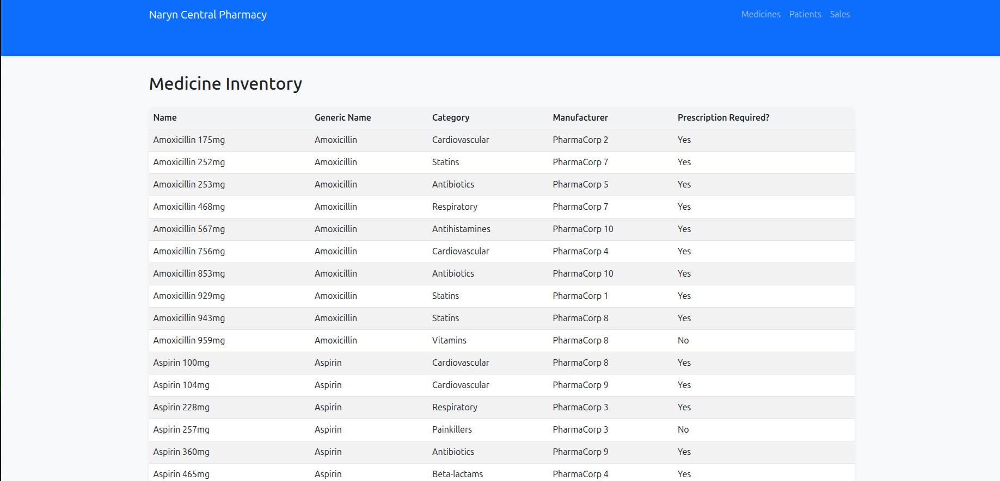
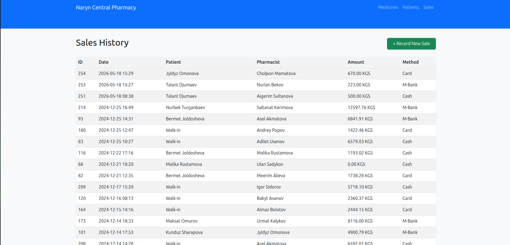
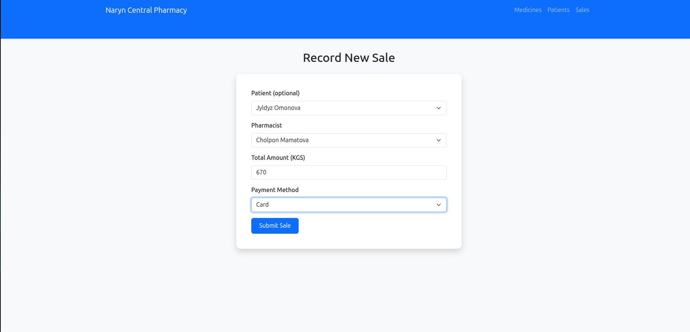

# Pharmacy Inventory & Prescription System (Naryn Central Pharmacy)

This project is a PostgreSQL-backed database system for managing a small pharmacy's inventory, prescriptions, and sales. It is designed to meet the requirements of the COMP 2082 Final Project.

## Features
- **Normalized Schema (3NF)**: 10 tables including hierarchical categories and employee management.
- **Realistic Kyrgyz Data**: 500+ records featuring local names, +996 phone numbers, and regional addresses.
- **Role-Based Security**: Defined roles for Admin, Pharmacist, and Inventory Manager.
- **Advanced SQL**: Includes views, non-trivial queries (CTEs, Joins), and transaction blocks.
- **Frontend**: A Python/Flask web application for interacting with the database.
- **Presentation**: A Reveal.js-based professional slide deck.

---
I, Mamadziyoev Murtuzo, hereby declare that the AI usage disclosed above is a complete and honest record of the assistance received during this project. I have reviewed, tested, and am responsible for every line of SQL and Python code included in this submission.

Signed: Mamadziyoev Murtuzo

## 🚀 Beginner's Guide: How to Run the Project

If you are new to databases and Python, follow these exact steps to get the project working on your computer.

### 1. Install Required Software
Ensure you have the following installed on your machine:
- **PostgreSQL (v15 or later)**: [Download here](https://www.postgresql.org/download/)
- **Python (v3.10 or later)**: [Download here](https://www.python.org/downloads/)

### 2. Set Up the Database
You need to create a database and fill it with the project data.
1. Open your terminal (or Command Prompt/PowerShell on Windows).
2. Create a new database named `pharmacy`:
   ```bash
   createdb -U postgres pharmacy
   ```
   *(If it asks for a password, enter the password you chose when installing PostgreSQL.)*
3. Load the data from the backup file:
   ```bash
   psql -U postgres -d pharmacy -f pharmacy_dump.sql
   ```
   *This one command creates all tables, adds the seed data, creates views, and sets up security roles.*

### 3. Set Up the Python Environment
This keeps the project's libraries organized.
1. In your terminal, navigate to the project folder.
2. Create a virtual environment:
   ```bash
   python -m venv venv
   ```
3. Activate the virtual environment:
   - **Windows**: `venv\Scripts\activate`
   - **macOS/Linux**: `source venv/bin/activate`
4. Install the required libraries:
   ```bash
   pip install Flask psycopg2-binary
   ```

### 4. Launch the Web Application
1. Start the application:
   ```bash
   python app.py
   ```
2. Open your web browser and go to:
   [http://localhost:5000](http://localhost:5000)

---

## 📂 Project Structure & Deliverables
- **`sql/`**: Contains individual scripts if you want to run them manually (Schema, Seed, Views, etc.).
- **`pharmacy_dump.sql`**: The full database backup.
- **`app.py`**: The main code for the web application.
- **`reports/project_report.md`**: Your technical project report (Normalization, AI disclosure, etc.).
- **`reports/defense_slides.html`**: Open this in your browser for your presentation.
- **`COMP2082_FinalProject_Jules.zip`**: The final archive for submission.

---

## 🛠 Troubleshooting
- **Database Connection**: If the app fails to start, open `app.py` and ensure the `DB_CONFIG` (host, user, password) matches your PostgreSQL settings.
- **Port 5000 Busy**: If you get a "port already in use" error, try running `python app.py` again or restart your computer.

---

## 📸 Visual Walkthrough

### 1. Inventory Management
The system provides a real-time view of all medicines, their categories, and prescription requirements.


### 2. Patient Records
Secure storage of patient information including Kyrgyz-specific contact details and medical history.


### 3. Sales Processing
A streamlined interface for creating new sales, ensuring inventory is updated atomically.


### 4. Sales History
Comprehensive audit trail of all transactions for reporting and management.

