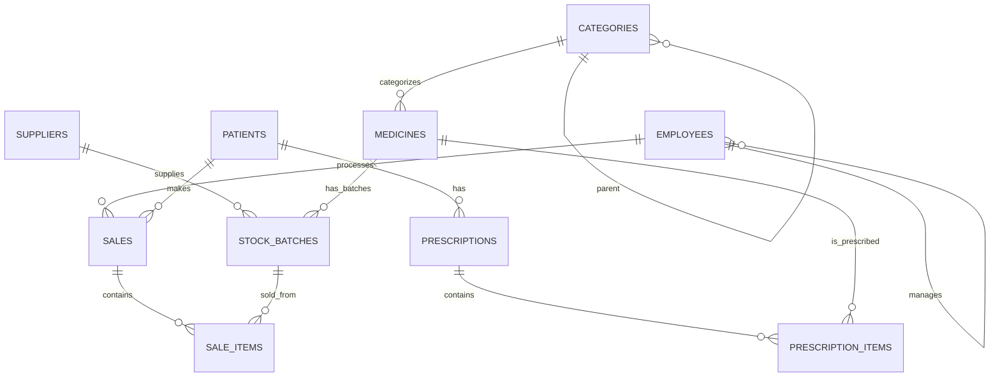

# ER Diagram (Mermaid.js)
Paste the following into [Mermaid Live Editor](https://mermaid.live/) to generate the ERD image for your report.

```mermaid
erDiagram
    CATEGORIES ||--o{ CATEGORIES : "parent"
    CATEGORIES ||--o{ MEDICINES : "categorizes"
    SUPPLIERS ||--o{ STOCK_BATCHES : "supplies"
    MEDICINES ||--o{ STOCK_BATCHES : "has_batches"
    EMPLOYEES ||--o{ EMPLOYEES : "manages"
    EMPLOYEES ||--o{ SALES : "processes"
    PATIENTS ||--o{ SALES : "makes"
    PATIENTS ||--o{ PRESCRIPTIONS : "has"
    PRESCRIPTIONS ||--o{ PRESCRIPTION_ITEMS : "contains"
    MEDICINES ||--o{ PRESCRIPTION_ITEMS : "is_prescribed"
    SALES ||--o{ SALE_ITEMS : "contains"
    STOCK_BATCHES ||--o{ SALE_ITEMS : "sold_from"
```
