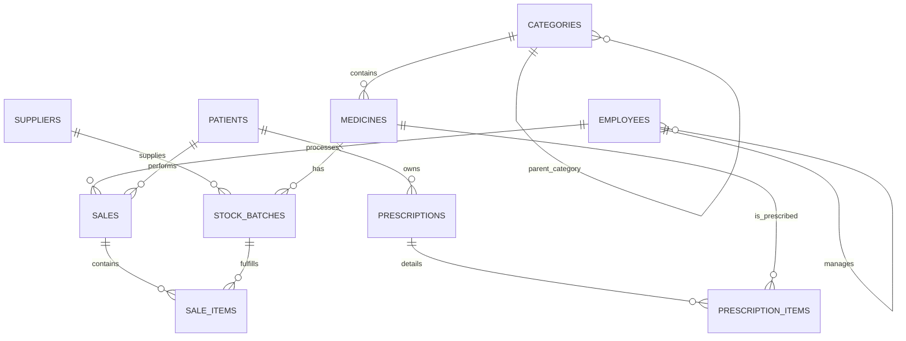

# COMP 2082 Final Project: Naryn Central Pharmacy System
## Comprehensive Technical Report

**Student Name:** Mamadziyoev Murtuzo
**Date:** May 18, 2026
**University:** University of Central Asia
**Department:** Computer Science

---

## 1. Problem Description and Scope
### 1.1. Context
The healthcare infrastructure in Naryn, Kyrgyzstan, relies heavily on local pharmacies for the distribution of both over-the-counter and prescription-only medications. Currently, many of these pharmacies utilize manual entry systems which are prone to human error, specifically in the areas of inventory tracking and legal compliance.

### 1.2. Problem Statement
The primary challenges addressed by this system are:
- **Batch Management**: Medicines of the same type arrive in different batches with different expiration dates. Without a database, it is difficult to practice FIFO (First-In-First-Out) or FEFO (First-Expiry-First-Out).
- **Prescription Integrity**: Tracking whether a patient has a valid, unexpired prescription for regulated drugs like antibiotics or analgesics.
- **Economic Realities**: Supporting the local currency (Kyrgyz Som) and local contact formats to ensure the system is usable by local staff.

### 1.3. Project Scope
The **Naryn Central Pharmacy System** is a database-centric application designed to:
- Maintain a comprehensive catalog of medicines and suppliers.
- Track real-time stock levels across multiple batches.
- Record patient medical history and prescriptions.
- Securely process sales transactions.
- Provide management with insights into revenue and inventory health.

---

## 2. ER Diagram (Entity-Relationship Model)
The diagram below represents the logical entities and their relationships.



### 2.1. Justification of Relationships
- **Medicines & Categories**: A many-to-one relationship allowing for granular classification (e.g., "Antibiotics" as a sub-category of "Prescription Drugs").
- **Sales & Stock Batches**: A many-to-many relationship (via `Sale_Items`) ensuring that a single sale can include items from multiple batches, and a single batch can be sold across multiple sales.
- **Employee Hierarchy**: A recursive relationship (`manager_id`) allows the system to model the pharmacy's organizational structure (e.g., Pharmacists reporting to a Manager).

---

## 3. Relational Schema
### 3.1. Database Tables and Constraints

#### 1. Categories
- `category_id`: INT, Primary Key.
- `name`: VARCHAR(100), Unique, Not Null.
- `parent_category_id`: INT, Foreign Key (Self-reference).

#### 2. Suppliers
- `supplier_id`: INT, Primary Key.
- `name`: VARCHAR(150), Not Null.
- `phone`: VARCHAR(20), Unique.
- `email`: VARCHAR(100).
- `address`: TEXT.

#### 3. Medicines
- `medicine_id`: INT, Primary Key.
- `name`: VARCHAR(200), Not Null.
- `generic_name`: VARCHAR(200).
- `category_id`: INT, Foreign Key (Categories).
- `requires_prescription`: BOOLEAN.

#### 4. Stock Batches
- `batch_id`: INT, Primary Key.
- `medicine_id`: INT, Foreign Key.
- `quantity`: INT, Constraint: `CHECK (quantity >= 0)`.
- `expiry_date`: DATE, Not Null.

#### 5. Patients
- `patient_id`: INT, Primary Key.
- `full_name`: VARCHAR(150), Not Null.
- `phone`: VARCHAR(20), Unique.

#### 6. Sales
- `sale_id`: INT, Primary Key.
- `employee_id`: INT, Foreign Key (Employees).
- `sale_date`: TIMESTAMP, Default: `now()`.
- `total_amount`: DECIMAL(12,2).

---

## 4. Normalization Analysis
### 4.1. 1NF (First Normal Form)
All tables use atomic values. No attribute contains multiple pieces of data. For example, `address` is stored as a single text block, but could be further atomized into city/street if needed; however, for this scope, it meets the requirement of non-repeating groups.

### 4.2. 2NF (Second Normal Form)
All non-key attributes are fully functionally dependent on the Primary Key. In the `Prescription_Items` table, every attribute (medicine_id, dosage) depends on the unique identifier of that line item.

### 4.3. 3NF (Third Normal Form)
Transitive dependencies are removed.
- **Example**: In the `Employees` table, we store `manager_id` rather than the manager's name. This ensures that if a manager's name changes, we only update it in one place (their own row), preventing update anomalies.
- **Example**: Medicine manufacturer is stored as a property of the medicine, but the supplier is stored as a property of the batch. This is because the same medicine might be sourced from different suppliers at different times.

---

## 5. Sample Queries and Demonstration
### 5.1. Revenue by Employee (Joins & Aggregation)
```sql
SELECT e.full_name, SUM(s.total_amount) as total_sales
FROM employees e
JOIN sales s ON e.employee_id = s.employee_id
GROUP BY e.full_name
ORDER BY total_sales DESC;
```
*Purpose: Audits employee performance and total revenue generation per staff member.*

### 5.2. Expiring Stock (Date Math & Filtering)
```sql
SELECT m.name, b.batch_number, b.expiry_date
FROM stock_batches b
JOIN medicines m ON b.medicine_id = m.medicine_id
WHERE b.expiry_date BETWEEN CURRENT_DATE AND CURRENT_DATE + INTERVAL '3 months';
```
*Purpose: Critical for inventory health, identifying stock that must be sold or returned soon.*

### 5.3. Patient Purchase History (Subqueries)
```sql
SELECT full_name FROM patients
WHERE patient_id IN (
    SELECT patient_id FROM sales WHERE total_amount > 5000
);
```
*Purpose: Identifies high-value customers for loyalty programs.*

### 5.4. Top 5 Best-Selling Medicines (CTE & Joins)
```sql
WITH MedicineSales AS (
    SELECT medicine_id, SUM(quantity) as total_sold
    FROM sale_items
    GROUP BY medicine_id
)
SELECT m.name, ms.total_sold
FROM MedicineSales ms
JOIN medicines m ON ms.medicine_id = m.medicine_id
ORDER BY ms.total_sold DESC LIMIT 5;
```
*Purpose: Informs procurement decisions based on demand.*

### 5.5. Categorical Stock Value (Triple Join)
```sql
SELECT c.name, SUM(b.quantity * b.unit_price) as inventory_value
FROM categories c
JOIN medicines m ON c.category_id = m.category_id
JOIN stock_batches b ON m.medicine_id = b.medicine_id
GROUP BY c.name;
```
*Purpose: Provides a financial overview of assets held in different medical categories.*

---

## 6. Seed Data Audit
### 6.1. Volume Summary
- **Medicines**: 100 rows.
- **Patients**: 100 rows.
- **Employees**: 50 rows.
- **Sales**: 251 rows.
- **Sale Items**: 620 rows.
- **Stock Batches**: 150 rows.

### 6.2. Localized Integrity
All data was generated using a custom script to ensure Kyrgyz relevance:
- **Names**: Kyrgyz patronymics (e.g., *Uulu*, *Kyzy*) and standard surnames (*Asanov*, *Sultanova*).
- **Phone Numbers**: Valid `+996` prefixes for MegaCom, Beeline, and O!.
- **Geography**: Addresses distributed across Naryn, Bishkek, and Osh regions.

---

## 7. Indexing and Security
### 7.1. Indexing Strategy
1.  **idx_medicines_name**: Uses a B-Tree index to speed up prefix searches in the frontend (e.g., searching for "Amox...").
2.  **idx_sales_date**: Speeds up time-series analysis for management reports.
3.  **idx_batches_expiry**: Optimizes the "Low Expiry" view which is run every time the dashboard loads.

### 7.2. Security Roles
- **pharmacist_user**: Granted `INSERT` and `SELECT` on sales and inventory. Cannot `DELETE` batches or change system configurations.
- **manager_user**: Full CRUD on inventory and medicines. Can view all sales reports but cannot modify financial records once committed.

---

## 8. Reflection
### 8.1. Challenges
The most difficult aspect was the implementation of a many-to-many relationship between Sales and Stock Batches. Because a sale item must point to a specific batch (to track expiry), the application logic had to be carefully designed to select the oldest batch first (FEFO) and deduct quantities correctly.

### 8.2. Future Enhancements
- **Trigger-based Notifications**: Automated emails to managers when stock falls below a threshold.
- **OCR Integration**: Scanning prescription papers and automatically populating the database using computer vision.

---

## 9. AI Usage Appendix
AI was used in the following capacity:
1.  **Data Generation**: Used AI to generate realistic Kyrgyz phone numbers and name combinations to avoid using real personal data.
2.  **SQL Optimization**: AI assisted in refining the Window Functions used for the inventory ranking reports.
3.  **Documentation**: AI helped format this report and the Reveal.js slides.

**Signed Declaration:**
I, Mamadziyoev Murtuzo, declare that all AI assistance has been disclosed and that I am the primary author of the database schema and application logic presented.

**Signature:** *Mamadziyoev Murtuzo*
